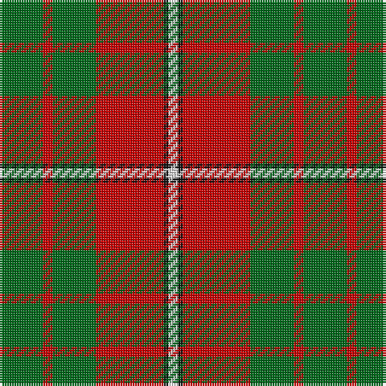

The parent of this is [MacGregor of Balquhidder Clan Tartan Tartan Number: 988. Earliest known date: 1831 This sett is shown in the earliest publication of clan tartans. James Logan collected material for, 'The Scottish Gael', around 1826 and published in 1831. A number of minor anomilies in Logans method of recording tartans has led to errors appearing in some versions of the sett. See products available Copyright © Blair Urquhart, Comrie, 2015](/tartans/g/18/r4/g18/r28/k2/ln/4/)

This was sourced from house-of-tartan.  It is a [6 stripes tartan](/stripes/stripes6/).

Original link http://www.house-of-tartan.scotland.net/house/TartanViewjs.asp?colr=Def&tnam=988

## Thread count
G/18 R4 G18 R28 K2 LN/4

## Palette
Each colour and its ΔE from the base-6 reference it is a variant of.

| Colour | Shade | Base | ΔE (OKLab) |
|---|---|---|---|
| G |  `#006818` | G  | 0.02 |
| K |  `#101010` | K  | 0.17 |
| LN |  `#E0E0E0` | W  | 0.06 |
| R |  `#C80000` | R  | 0.00 |

# Sample pattern

ID: /variants/g/18/r4/g18/r28/k2/ln/4-g006818-k101010-lne0e0e0-rc80000/
