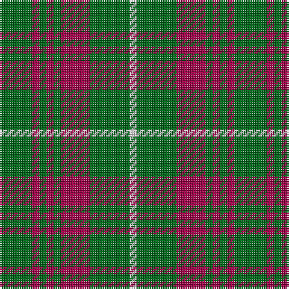

The parent of this is [Leeds University Corporate Tartan Tartan Number: 980. Earliest known date: pre 2003 Leeds University Scottish Country Dance Club. See products available Copyright © Blair Urquhart, Comrie, 2015](/tartans/g/18/r4/g4/r4/g4/r16/g22/ln/4/)

This was sourced from house-of-tartan.  It is a [8 stripes tartan](/stripes/stripes8/).

Original link http://www.house-of-tartan.scotland.net/house/TartanViewjs.asp?colr=Def&tnam=980

## Thread count
G/18 R4 G4 R4 G4 R16 G22 LN/4

## Palette
Each colour and its ΔE from the base-6 reference it is a variant of.

| Colour | Shade | Base | ΔE (OKLab) |
|---|---|---|---|
| G |  `#006818` | G  | 0.02 |
| LN |  `#E0E0E0` | W  | 0.06 |
| R |  `#A00048` | R  | 0.11 |

# Sample pattern

ID: /variants/g/18/r4/g4/r4/g4/r16/g22/ln/4-g006818-lne0e0e0-ra00048/
