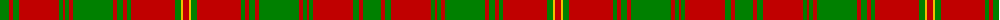

The parent of this is [Hebrides Outer](/tartans/g/18/r4/g6/r40/g4/r2/g4/r4/g40/r4/g6/r4/g4/r44/g6/y2/r/6/)

This was sourced from weddslist.  It is a [17 stripes tartan](/stripes/stripes17/).

Original link http://www.weddslist.com/cgi-bin/tartans/pg.pl?source=sts

## Thread count
G/18 R4 G6 R40 G4 R2 G4 R4 G40 R4 G6 R4 G4 R44 G6 Y2 R/6

## Palette
Each colour and its ΔE from the base-6 reference it is a variant of.

| Colour | Shade | Base | ΔE (OKLab) |
|---|---|---|---|
| G |  `#008000` | G  | 0.09 |
| R |  `#C00000` | R  | 0.02 |
| Y |  `#F0C000` | Y  | 0.01 |

ID: /variants/g/18/r4/g6/r40/g4/r2/g4/r4/g40/r4/g6/r4/g4/r44/g6/y2/r/6-g008000-rc00000-yf0c000/
