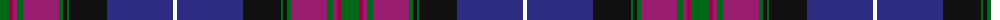

The parent of this is [Pride of Scotland (Fashion)](/tartans/g/18/r4/p4/g6/p36/g4/k4/g2/k38/db66/w/4/)

This was sourced from tartans-authority.  It is a [11 stripes tartan](/stripes/stripes11/).

Original link http://www.tartansauthority.com/tartan-ferret/display/2469/

## Thread count
G/18 R4 P4 G6 P36 G4 K4 G2 K38 DB66 W/4

## Palette
Each colour and its ΔE from the base-6 reference it is a variant of.

| Colour | Shade | Base | ΔE (OKLab) |
|---|---|---|---|
| DB |  `#2C2C80` | B  | 0.05 |
| G |  `#006818` | G  | 0.02 |
| K |  `#101010` | K  | 0.17 |
| P |  `#981C70` | R  | 0.16 |
| R |  `#A00048` | R  | 0.11 |
| W |  `#FCFCFC` | W  | 0.03 |

ID: /variants/g/18/r4/p4/g6/p36/g4/k4/g2/k38/db66/w/4-db2c2c80-g006818-k101010-p981c70-ra00048-wfcfcfc/
