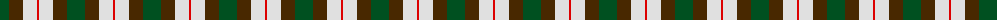
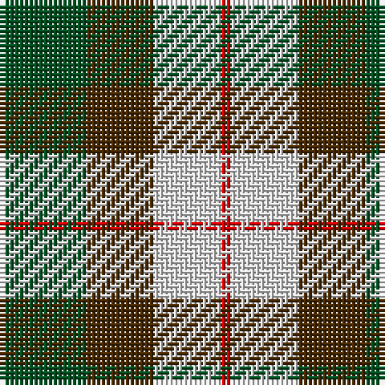

The parent of this is [MacKinnon Dress](/tartans/g/18/t14/ln14/r/2/)

This was sourced from register-of-tartans.  It is a [4 stripes tartan](/stripes/stripes4/).

Original link https://www.tartanregister.gov.uk/tartanDetails.aspx?ref=2554

## Thread count
G/18 T14 LN14 R/2

## Palette
Each colour and its ΔE from the base-6 reference it is a variant of.

| Colour | Shade | Base | ΔE (OKLab) |
|---|---|---|---|
| G |  `#005020` | G  | 0.08 |
| LN |  `#E0E0E0` | W  | 0.06 |
| R |  `#DC0000` | R  | 0.04 |
| T |  `#482800` | G  | 0.19 |

# Sample pattern

ID: /variants/g/18/t14/ln14/r/2-g005020-lne0e0e0-rdc0000-t482800/
