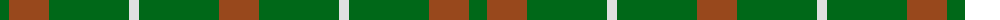
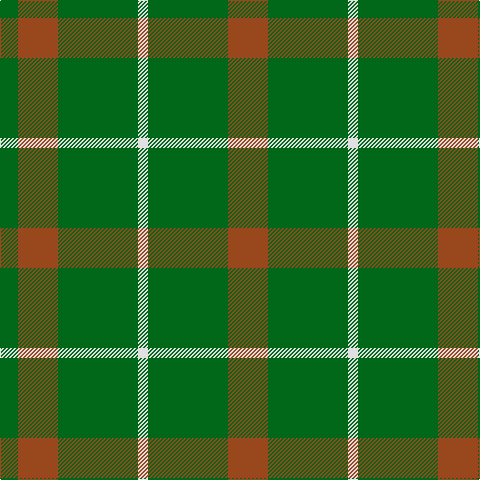

The parent of this is [O'Neill (Australia)](/tartans/g/18/t40/g80/ln10/g80/t/40/)

This was sourced from register-of-tartans.  It is a [6 stripes tartan](/stripes/stripes6/).

Original link https://www.tartanregister.gov.uk/tartanDetails.aspx?ref=3248

## Thread count
G/18 T40 G80 LN10 G80 T/40

## Palette
Each colour and its ΔE from the base-6 reference it is a variant of.

| Colour | Shade | Base | ΔE (OKLab) |
|---|---|---|---|
| G |  `#006818` | G  | 0.02 |
| LN |  `#E0E0E0` | W  | 0.06 |
| T |  `#98481C` | R  | 0.11 |

# Sample pattern

ID: /variants/g/18/t40/g80/ln10/g80/t/40-g006818-lne0e0e0-t98481c/
