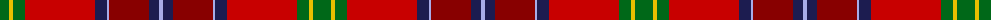

The parent of this is [Telfer Name Tartan Tartan Number: 10083. Earliest known date: 2009 As a child the designer went to church in a kilt of Royal Stewart tartan, a gift from his parents. The Duncan Telfer tartan, although different in design to the Stewart tartan, echoes it in its structure. But here the predominance of red and its opposition to the green symbolises how the ancestors of the Telfers arrived in Britain on the tide of battle during the Norman invasion. This affinity is augmented by the clash of steel blue stripes. This strife is also silently witnessed by the sky (blue), trees (green) and the sun (gold). The designer would like to dedicate this tartan to the memory of his parents, James and Margaret Telfer. This tartan is for the use of all of the name of Telfer. Although there are no restrictions, anyone intending to manufacture or use this tartan is encouraged to contact the designer (or his direct descendants) and a choice of preferred charities will be offered for a suggested donation. Copyright of this design belongs to Duncan Telfer. It was developed for weaving by House of Tartan. See products available Copyright © Blair Urquhart, Comrie, 2015](/tartans/g/18/y4/g12/r70/dba12/lp2/dr40/dba10/lp/4/)

This was sourced from house-of-tartan.  It is a [9 stripes tartan](/stripes/stripes9/).

Original link http://www.house-of-tartan.scotland.net/house/TartanViewjs.asp?colr=Def&tnam=10083

## Thread count
G/18 Y4 G12 R70 DBa12 LP2 DR40 DBa10 LP/4

## Palette
Each colour and its ΔE from the base-6 reference it is a variant of.

| Colour | Shade | Base | ΔE (OKLab) |
|---|---|---|---|
| DB |  `#2C2C80` | B  | 0.05 |
| DBa |  `#1C1C50` | B  | 0.14 |
| DR |  `#880000` | R  | 0.14 |
| DY |  `#BC8C00` | Y  | 0.16 |
| G |  `#006818` | G  | 0.02 |
| K |  `#101010` | K  | 0.17 |
| LP |  `#A8ACE8` | W  | 0.22 |
| R |  `#C80000` | R  | 0.00 |
| Ra |  `#C8002C` | R  | 0.03 |
| Y |  `#E8C000` | Y  | 0.00 |

ID: /variants/g/18/y4/g12/r70/dba12/lp2/dr40/dba10/lp/4-db2c2c80-dba1c1c50-dr880000-dybc8c00-g006818-k101010-lpa8ace8-rc80000-rac8002c-ye8c000/
