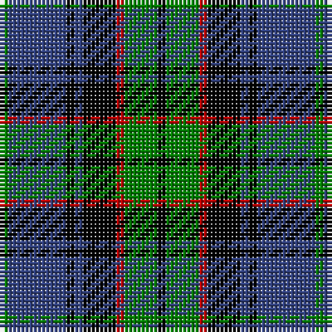

The parent of this is [Brabender](/tartans/g/2/b14/k2/b2/k8/r2/g8/k/2/)

This was sourced from weddslist.  It is a [8 stripes tartan](/stripes/stripes8/).

Original link http://www.weddslist.com/cgi-bin/tartans/pg.pl?source=sts

## Thread count
G/2 B14 K2 B2 K8 R2 G8 K/2

## Palette
Each colour and its ΔE from the base-6 reference it is a variant of.

| Colour | Shade | Base | ΔE (OKLab) |
|---|---|---|---|
| B |  `#304080` | B  | 0.01 |
| G |  `#008000` | G  | 0.09 |
| K |  `#000000` | K  | 0.00 |
| R |  `#C00000` | R  | 0.02 |

# Sample pattern

ID: /variants/g/2/b14/k2/b2/k8/r2/g8/k/2-b304080-g008000-k000000-rc00000/
