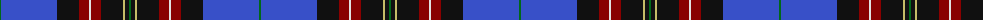

The parent of this is [Scragg, Moran (Personal)](/tartans/g/2/b56/k22/dr10/ln2/dr10/k22/lg2/k4/g/2/)

This was sourced from tartans-authority.  It is a [10 stripes tartan](/stripes/stripes10/).

Original link http://www.tartansauthority.com/tartan-ferret/display/10381/

## Thread count
G/2 B56 K22 DR10 LN2 DR10 K22 LG2 K4 G/2

## Palette
Each colour and its ΔE from the base-6 reference it is a variant of.

| Colour | Shade | Base | ΔE (OKLab) |
|---|---|---|---|
| B |  `#3850C8` | B  | 0.12 |
| DR |  `#880000` | R  | 0.14 |
| G |  `#006818` | G  | 0.02 |
| K |  `#101010` | K  | 0.17 |
| LG |  `#C4BC68` | Y  | 0.07 |
| LN |  `#E0E0E0` | W  | 0.06 |

ID: /variants/g/2/b56/k22/dr10/ln2/dr10/k22/lg2/k4/g/2-b3850c8-dr880000-g006818-k101010-lgc4bc68-lne0e0e0/
