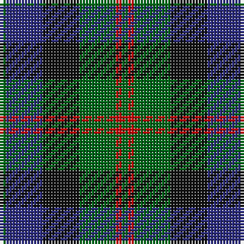

The parent of this is [Callum Beg (Fashion)](/tartans/g/2/db12/k12/g12/r2/g/2/)

This was sourced from tartans-authority.  It is a [6 stripes tartan](/stripes/stripes6/).

Original link http://www.tartansauthority.com/tartan-ferret/display/8077/

## Thread count
G/2 DB12 K12 G12 R2 G/2

## Palette
Each colour and its ΔE from the base-6 reference it is a variant of.

| Colour | Shade | Base | ΔE (OKLab) |
|---|---|---|---|
| DB |  `#2C2C80` | B  | 0.05 |
| G |  `#006818` | G  | 0.02 |
| K |  `#101010` | K  | 0.17 |
| R |  `#C80000` | R  | 0.00 |

# Sample pattern

ID: /variants/g/2/db12/k12/g12/r2/g/2-db2c2c80-g006818-k101010-rc80000/
