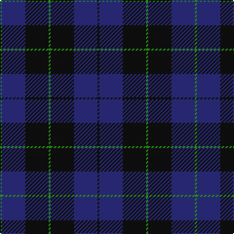

The parent of this is [Marchmont Personal Tartan Tartan Number: 2521. Earliest known date: 1997 Designed by Keith Lumsden of Scottish Tartans Society. A tartan for personal blankets and clothing. See products available Copyright © Blair Urquhart, Comrie, 2015](/tartans/g/2/db24/k24/g2/k24/db24/k/2/)

This was sourced from house-of-tartan.  It is a [7 stripes tartan](/stripes/stripes7/).

Original link http://www.house-of-tartan.scotland.net/house/TartanViewjs.asp?colr=Def&tnam=2521

## Thread count
G/2 DB24 K24 G2 K24 DB24 K/2

## Palette
Each colour and its ΔE from the base-6 reference it is a variant of.

| Colour | Shade | Base | ΔE (OKLab) |
|---|---|---|---|
| DB |  `#2C2C80` | B  | 0.05 |
| G |  `#289C18` | G  | 0.18 |
| K |  `#101010` | K  | 0.17 |

# Sample pattern

ID: /variants/g/2/db24/k24/g2/k24/db24/k/2-db2c2c80-g289c18-k101010/
