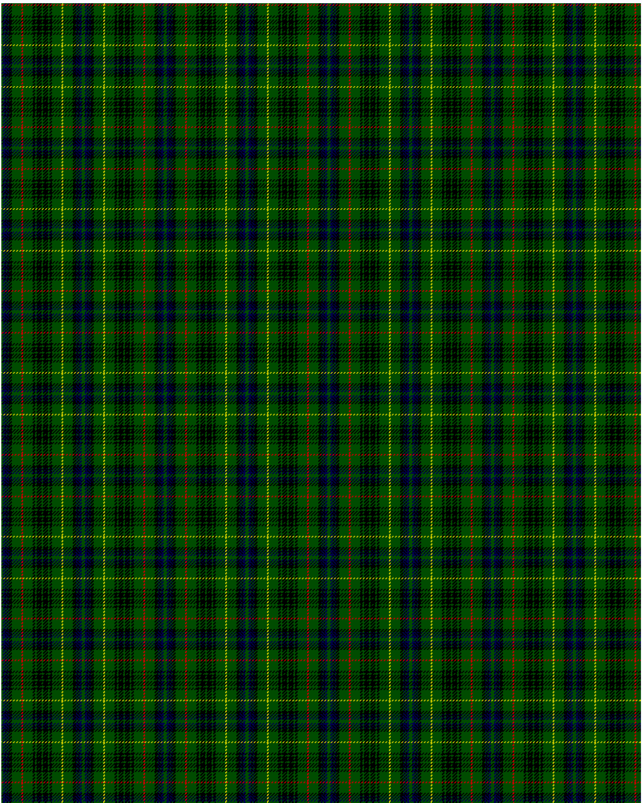

Stewart Hunting D

This was sourced from <no value>.  It is a 27 stripes tartan.

Original link http://www.weddslist.com/cgi-bin/tartans/pg.pl?source=rb

## Thread count
G/2 DB3 K1 DB1 K1 DB1 K4 G12 R2 G12 K3 G2 K6 G2 K6 G2 K3 G12 Y2 G12 K4 DB1 K1 DB1 K1 DB3 G/2

## Palette
DB#00004C G#004C00 K#000000 R#C80000 Y#C8C800

# Sample pattern

ID: /variants/g/2/db3/k1/db1/k1/db1/k4/g12/r2/g12/k3/g2/k6/g2/k6/g2/k3/g12/y2/g12/k4/db1/k1/db1/k1/db3/g/2-db00004c-g004c00-k000000-rc80000-yc8c800