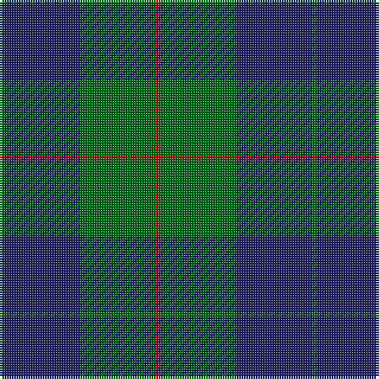

The parent of this is [Barclay Hunting Clan Tartan Tartan Number: 705. Earliest known date: 1842 The 'Vestiarium' attempted to persuade its readers that the illustrated tartans were of great antiquity. Despite this fault the work contains the earliest record of many tartans some of which have been verified by other means. Innes, Stewart, and W & A K Johnston, also record this sett. See products available Copyright © Blair Urquhart, Comrie, 2015](/tartans/g/2/db32/g32/r/2/)

This was sourced from house-of-tartan.  It is a [4 stripes tartan](/stripes/stripes4/).

Original link http://www.house-of-tartan.scotland.net/house/TartanViewjs.asp?colr=Def&tnam=705

## Thread count
G/2 DB32 G32 R/2

## Palette
Each colour and its ΔE from the base-6 reference it is a variant of.

| Colour | Shade | Base | ΔE (OKLab) |
|---|---|---|---|
| DB |  `#202060` | B  | 0.11 |
| G |  `#006818` | G  | 0.02 |
| R |  `#C80000` | R  | 0.00 |

# Sample pattern

ID: /variants/g/2/db32/g32/r/2-db202060-g006818-rc80000/
