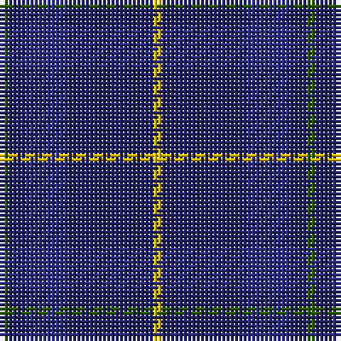

The parent of this is [Open Championship (2000)](/tartans/g/2/db4/dba10/db20/y/2/)

This was sourced from register-of-tartans.  It is a [5 stripes tartan](/stripes/stripes5/).

Original link https://www.tartanregister.gov.uk/tartanDetails.aspx?ref=3257

## Thread count
G/2 DB4 DBa10 DB20 Y/2

## Palette
Each colour and its ΔE from the base-6 reference it is a variant of.

| Colour | Shade | Base | ΔE (OKLab) |
|---|---|---|---|
| DB |  `#202060` | B  | 0.11 |
| DBa |  `#2C2C80` | B  | 0.05 |
| G |  `#285800` | G  | 0.04 |
| Y |  `#E8C000` | Y  | 0.00 |

# Sample pattern

ID: /variants/g/2/db4/dba10/db20/y/2-db202060-dba2c2c80-g285800-ye8c000/
