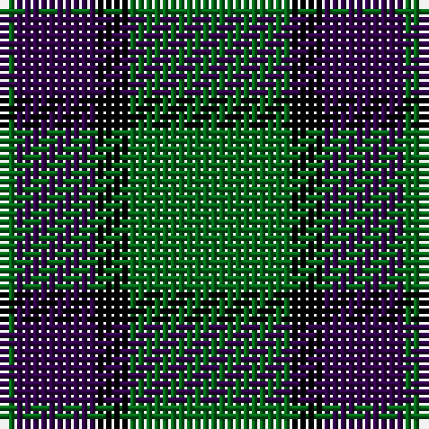

The parent of this is [Bumbee #1 (Fashion)](/tartans/g/2/dp10/k4/g/20/)

This was sourced from tartans-authority.  It is a [4 stripes tartan](/stripes/stripes4/).

Original link http://www.tartansauthority.com/tartan-ferret/display/3764/

## Thread count
G/2 DP10 K4 G/20

## Palette
Each colour and its ΔE from the base-6 reference it is a variant of.

| Colour | Shade | Base | ΔE (OKLab) |
|---|---|---|---|
| DP |  `#300048` | B  | 0.18 |
| G |  `#006818` | G  | 0.02 |
| K |  `#000000` | K  | 0.00 |

# Sample pattern

ID: /variants/g/2/dp10/k4/g/20-dp300048-g006818-k000000/
