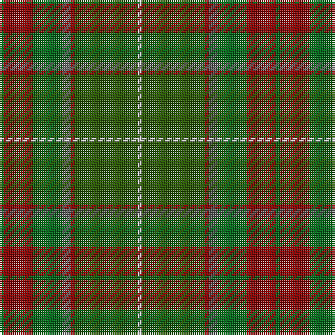

The parent of this is [Ramsay (Green Fashion)](/tartans/g/2/dr14/g14/n4/dr2/ga30/na/2/)

This was sourced from register-of-tartans.  It is a [7 stripes tartan](/stripes/stripes7/).

Original link https://www.tartanregister.gov.uk/tartanDetails.aspx?ref=5006

## Thread count
G/2 DR14 G14 N4 DR2 Ga30 Na/2

## Palette
Each colour and its ΔE from the base-6 reference it is a variant of.

| Colour | Shade | Base | ΔE (OKLab) |
|---|---|---|---|
| DR |  `#880000` | R  | 0.14 |
| G |  `#006818` | G  | 0.02 |
| Ga |  `#285800` | G  | 0.04 |
| N |  `#5C5C5C` | B  | 0.14 |
| Na |  `#C0C0C0` | W  | 0.16 |

# Sample pattern

ID: /variants/g/2/dr14/g14/n4/dr2/ga30/na/2-dr880000-g006818-ga285800-n5c5c5c-nac0c0c0/
