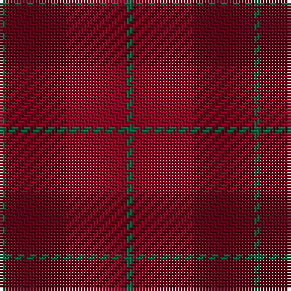

The parent of this is [Stirling of Keir (Clan)](/tartans/g/2/dr20/dra20/g/2/)

This was sourced from tartans-authority.  It is a [4 stripes tartan](/stripes/stripes4/).

Original link http://www.tartansauthority.com/tartan-ferret/display/7817/

## Thread count
G/2 DR20 DRa20 G/2

## Palette
Each colour and its ΔE from the base-6 reference it is a variant of.

| Colour | Shade | Base | ΔE (OKLab) |
|---|---|---|---|
| DR |  `#5C0014` | B  | 0.22 |
| DRa |  `#8C0020` | R  | 0.13 |
| G |  `#006840` | G  | 0.06 |

# Sample pattern

ID: /variants/g/2/dr20/dra20/g/2-dr5c0014-dra8c0020-g006840/
