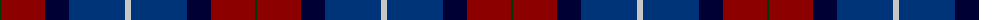

The parent of this is [Diaspora (Fashion)](/tartans/g/2/dr44/db24/dba56/n/6/)

This was sourced from tartans-authority.  It is a [5 stripes tartan](/stripes/stripes5/).

Original link http://www.tartansauthority.com/tartan-ferret/display/2690/

## Thread count
G/2 DR44 DB24 DBa56 N/6

## Palette
Each colour and its ΔE from the base-6 reference it is a variant of.

| Colour | Shade | Base | ΔE (OKLab) |
|---|---|---|---|
| DB |  `#000034` | K  | 0.18 |
| DBa |  `#003478` | B  | 0.06 |
| DR |  `#8C0000` | R  | 0.13 |
| G |  `#003800` | G  | 0.15 |
| N |  `#C8C8C8` | W  | 0.13 |

# Sample pattern

ID: /variants/g/2/dr44/db24/dba56/n/6-db000034-dba003478-dr8c0000-g003800-nc8c8c8/
