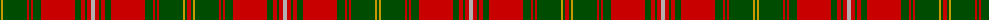

The parent of this is [Hayes](/tartans/g/2/dy2/g24/r2/g2/r2/g8/r34/g6/r4/g2/r4/n4/r4/g2/r4/g6/r34/g8/r2/g2/r2/g24/dy2/g2/r/4/)

This was sourced from register-of-tartans.  It is a [26 stripes tartan](/stripes/stripes26/).

Original link https://www.tartanregister.gov.uk/tartanDetails.aspx?ref=1636

## Thread count
G/2 DY2 G24 R2 G2 R2 G8 R34 G6 R4 G2 R4 N4 R4 G2 R4 G6 R34 G8 R2 G2 R2 G24 DY2 G2 R/4

## Palette
Each colour and its ΔE from the base-6 reference it is a variant of.

| Colour | Shade | Base | ΔE (OKLab) |
|---|---|---|---|
| DR |  `#880000` | R  | 0.14 |
| DY |  `#C89800` | Y  | 0.12 |
| G |  `#004C00` | G  | 0.08 |
| N |  `#B0B0B0` | Y  | 0.18 |
| R |  `#C80000` | R  | 0.00 |

ID: /variants/g/2/dy2/g24/r2/g2/r2/g8/r34/g6/r4/g2/r4/n4/r4/g2/r4/g6/r34/g8/r2/g2/r2/g24/dy2/g2/r/4-dr880000-dyc89800-g004c00-nb0b0b0-rc80000/
