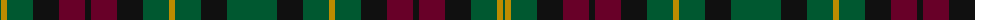

The parent of this is [Burns Heritage (Corporate)](/tartans/g/2/dy6/g26/k26/dr26/k6/dr26/k26/g26/dy6/g26/k26/g/50/)

This was sourced from tartans-authority.  It is a [13 stripes tartan](/stripes/stripes13/).

Original link http://www.tartansauthority.com/tartan-ferret/display/4515/

## Thread count
G/2 DY6 G26 K26 DR26 K6 DR26 K26 G26 DY6 G26 K26 G/50

## Palette
Each colour and its ΔE from the base-6 reference it is a variant of.

| Colour | Shade | Base | ΔE (OKLab) |
|---|---|---|---|
| DR |  `#680028` | B  | 0.20 |
| DY |  `#BC8C00` | Y  | 0.16 |
| G |  `#005830` | G  | 0.06 |
| K |  `#101010` | K  | 0.17 |

ID: /variants/g/2/dy6/g26/k26/dr26/k6/dr26/k26/g26/dy6/g26/k26/g/50-dr680028-dybc8c00-g005830-k101010/
