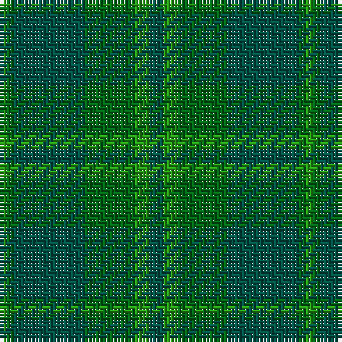

The parent of this is [Emerald (Fashion)](/tartans/g/2/gb2/ga20/gb14/g4/ga/4/)

This was sourced from tartans-authority.  It is a [6 stripes tartan](/stripes/stripes6/).

Original link http://www.tartansauthority.com/tartan-ferret/display/4813/

## Thread count
G/2 Gb2 Ga20 Gb14 G4 Ga/4

## Palette
Each colour and its ΔE from the base-6 reference it is a variant of.

| Colour | Shade | Base | ΔE (OKLab) |
|---|---|---|---|
| G |  `#289C18` | G  | 0.18 |
| Ga |  `#005448` | G  | 0.11 |
| Gb |  `#006818` | G  | 0.02 |

# Sample pattern

ID: /variants/g/2/gb2/ga20/gb14/g4/ga/4-g289c18-ga005448-gb006818/
