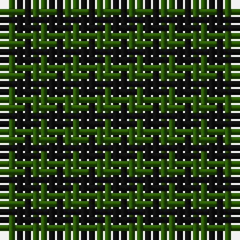

The parent of this is [Robin Hood (Fashion)](/tartans/g/2/k/2/)

This was sourced from tartans-authority.  It is a [2 stripes tartan](/stripes/stripes2/).

Original link http://www.tartansauthority.com/tartan-ferret/display/785/

## Thread count
G/2 K/2

## Palette
G K

# Sample pattern

ID: /variants/g/2/k/2-g285800-k101010/
