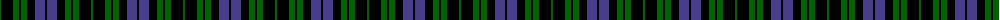
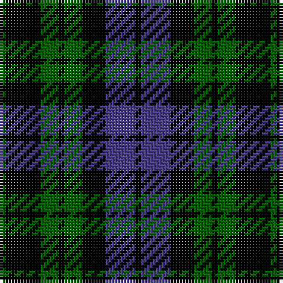

The parent of this is [Keith McCormick (Personal)](/tartans/g/2/k12/g6/k2/g6/k8/b10/k/2/)

This was sourced from register-of-tartans.  It is a [8 stripes tartan](/stripes/stripes8/).

Original link https://www.tartanregister.gov.uk/tartanDetails.aspx?ref=10011

## Thread count
G/2 K12 G6 K2 G6 K8 B10 K/2

## Palette
Each colour and its ΔE from the base-6 reference it is a variant of.

| Colour | Shade | Base | ΔE (OKLab) |
|---|---|---|---|
| B |  `#483D8B` | B  | 0.04 |
| G |  `#006400` | G  | 0.00 |
| K |  `#000000` | K  | 0.00 |

# Sample pattern

ID: /variants/g/2/k12/g6/k2/g6/k8/b10/k/2-b483d8b-g006400-k000000/
