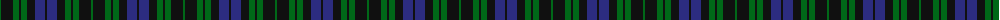
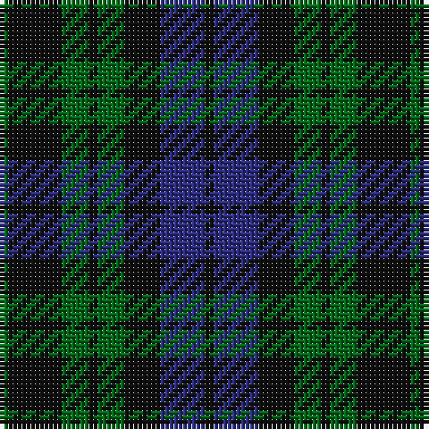

The parent of this is [McCormick, Keith (Personal) Canadian Personal Tartan Tartan Number: 10011. Earliest known date: Apr. 2009 A personal tartan for Keith McCormick and his family. Blue represents the Nashwaak River, a well known salmon river in New Brunswick; green is for the forest through which the river flows and since the designer is a retired barrister, his gown is represented by the black. This tartan is for the use of Keith McCormick, his immediate family and those with his permission during his lifetime. After Keith McCormick's death, this tartan can be worn by any of the name McCormick or its variants. This tartan should only be woven by permission of Keith McCormick during his lifetime. After Keith McCormick's death, it may be woven by anyone. See products available Copyright © Blair Urquhart, Comrie, 2015](/tartans/g/2/k12/g6/k2/g6/k8/db10/k/2/)

This was sourced from house-of-tartan.  It is a [8 stripes tartan](/stripes/stripes8/).

Original link http://www.house-of-tartan.scotland.net/house/TartanViewjs.asp?colr=Def&tnam=10011

## Thread count
G/2 K12 G6 K2 G6 K8 DB10 K/2

## Palette
Each colour and its ΔE from the base-6 reference it is a variant of.

| Colour | Shade | Base | ΔE (OKLab) |
|---|---|---|---|
| DB |  `#2C2C80` | B  | 0.05 |
| G |  `#006818` | G  | 0.02 |
| K |  `#101010` | K  | 0.17 |

# Sample pattern

ID: /variants/g/2/k12/g6/k2/g6/k8/db10/k/2-db2c2c80-g006818-k101010/
