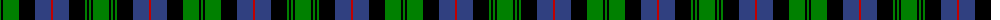

The parent of this is [Urquhart](/tartans/g/2/k2/g16/k16/b16/r2/b16/k16/g2/k2/g2/k2/g/16/)

This was sourced from weddslist.  It is a [13 stripes tartan](/stripes/stripes13/).

Original link http://www.weddslist.com/cgi-bin/tartans/pg.pl?source=sts

## Thread count
G/2 K2 G16 K16 B16 R2 B16 K16 G2 K2 G2 K2 G/16

## Palette
Each colour and its ΔE from the base-6 reference it is a variant of.

| Colour | Shade | Base | ΔE (OKLab) |
|---|---|---|---|
| B |  `#304080` | B  | 0.01 |
| G |  `#008000` | G  | 0.09 |
| K |  `#000000` | K  | 0.00 |
| R |  `#C00000` | R  | 0.02 |

ID: /variants/g/2/k2/g16/k16/b16/r2/b16/k16/g2/k2/g2/k2/g/16-b304080-g008000-k000000-rc00000/
