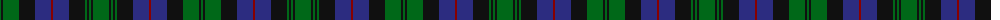

The parent of this is [Urquhart (Logan)](/tartans/g/2/k2/g16/k16/db16/dr2/db16/k16/g2/k2/g2/k2/g/16/)

This was sourced from register-of-tartans.  It is a [13 stripes tartan](/stripes/stripes13/).

Original link https://www.tartanregister.gov.uk/tartanDetails.aspx?ref=4433

## Thread count
G/2 K2 G16 K16 DB16 DR2 DB16 K16 G2 K2 G2 K2 G/16

## Palette
Each colour and its ΔE from the base-6 reference it is a variant of.

| Colour | Shade | Base | ΔE (OKLab) |
|---|---|---|---|
| DB |  `#2C2C80` | B  | 0.05 |
| DR |  `#880000` | R  | 0.14 |
| G |  `#006818` | G  | 0.02 |
| K |  `#101010` | K  | 0.17 |

ID: /variants/g/2/k2/g16/k16/db16/dr2/db16/k16/g2/k2/g2/k2/g/16-db2c2c80-dr880000-g006818-k101010/
