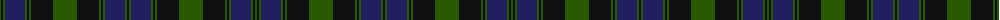

The parent of this is [Herron of Ulster (Personal)](/tartans/g/2/k2/g2/db20/g2/k2/g2/k22/g24/k22/g2/k2/g2/db20/g2/k/2/)

This was sourced from register-of-tartans.  It is a [16 stripes tartan](/stripes/stripes16/).

Original link https://www.tartanregister.gov.uk/tartanDetails.aspx?ref=1698

## Thread count
G/2 K2 G2 DB20 G2 K2 G2 K22 G24 K22 G2 K2 G2 DB20 G2 K/2

## Palette
Each colour and its ΔE from the base-6 reference it is a variant of.

| Colour | Shade | Base | ΔE (OKLab) |
|---|---|---|---|
| DB |  `#202060` | B  | 0.11 |
| DG |  `#003820` | G  | 0.16 |
| G |  `#285800` | G  | 0.04 |
| Ga |  `#006818` | G  | 0.02 |
| K |  `#101010` | K  | 0.17 |

ID: /variants/g/2/k2/g2/db20/g2/k2/g2/k22/g24/k22/g2/k2/g2/db20/g2/k/2-db202060-dg003820-g285800-ga006818-k101010/
