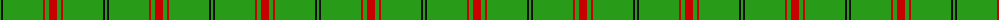
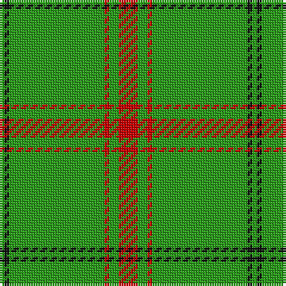

The parent of this is [Loch Laggan (District)](/tartans/g/2/k2/g40/r2/g4/r/8/)

This was sourced from tartans-authority.  It is a [6 stripes tartan](/stripes/stripes6/).

Original link http://www.tartansauthority.com/tartan-ferret/display/796/

## Thread count
G/2 K2 G40 R2 G4 R/8

## Palette
Each colour and its ΔE from the base-6 reference it is a variant of.

| Colour | Shade | Base | ΔE (OKLab) |
|---|---|---|---|
| G |  `#289C18` | G  | 0.18 |
| K |  `#101010` | K  | 0.17 |
| R |  `#C80000` | R  | 0.00 |

# Sample pattern

ID: /variants/g/2/k2/g40/r2/g4/r/8-g289c18-k101010-rc80000/
