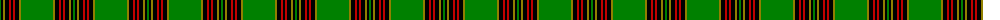

The parent of this is [Forde](/tartans/g/2/k2/lg2/k4/r2/k2/r2/k4/lg2/g/32/)

This was sourced from weddslist.  It is a [10 stripes tartan](/stripes/stripes10/).

Original link http://www.weddslist.com/cgi-bin/tartans/pg.pl?source=sts

## Thread count
G/2 K2 LG2 K4 R2 K2 R2 K4 LG2 G/32

## Palette
Each colour and its ΔE from the base-6 reference it is a variant of.

| Colour | Shade | Base | ΔE (OKLab) |
|---|---|---|---|
| G |  `#008000` | G  | 0.09 |
| K |  `#000000` | K  | 0.00 |
| LG |  `#908000` | G  | 0.19 |
| R |  `#C00000` | R  | 0.02 |

ID: /variants/g/2/k2/lg2/k4/r2/k2/r2/k4/lg2/g/32-g008000-k000000-lg908000-rc00000/
