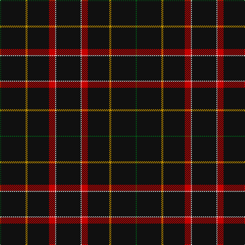

The parent of this is [Gourlay, George (Personal)](/tartans/g/2/k48/dy4/k42/r12/ln2/k/48/)

This was sourced from tartans-authority.  It is a [7 stripes tartan](/stripes/stripes7/).

Original link http://www.tartansauthority.com/tartan-ferret/display/10266/

## Thread count
G/2 K48 DY4 K42 R12 LN2 K/48

## Palette
Each colour and its ΔE from the base-6 reference it is a variant of.

| Colour | Shade | Base | ΔE (OKLab) |
|---|---|---|---|
| DY |  `#BC8C00` | Y  | 0.16 |
| G |  `#006818` | G  | 0.02 |
| K |  `#101010` | K  | 0.17 |
| LN |  `#E0E0E0` | W  | 0.06 |
| R |  `#C80000` | R  | 0.00 |

# Sample pattern

ID: /variants/g/2/k48/dy4/k42/r12/ln2/k/48-dybc8c00-g006818-k101010-lne0e0e0-rc80000/
