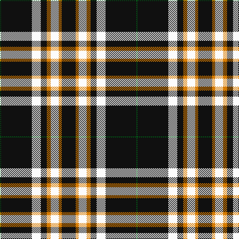

The parent of this is [Entrepreneurial Spark](/tartans/g/2/k62/w18/k12/o8/w16/o6/k/28/)

This was sourced from tartans-authority.  It is a [8 stripes tartan](/stripes/stripes8/).

Original link http://www.tartansauthority.com/tartan-ferret/display/10996/

## Thread count
G/2 K62 W18 K12 O8 W16 O6 K/28

## Palette
Each colour and its ΔE from the base-6 reference it is a variant of.

| Colour | Shade | Base | ΔE (OKLab) |
|---|---|---|---|
| G |  `#006818` | G  | 0.02 |
| K |  `#101010` | K  | 0.17 |
| O |  `#D87C00` | Y  | 0.17 |
| W |  `#FCFCFC` | W  | 0.03 |

# Sample pattern

ID: /variants/g/2/k62/w18/k12/o8/w16/o6/k/28-g006818-k101010-od87c00-wfcfcfc/
