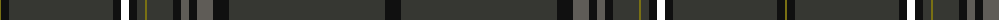

The parent of this is [Maxem Eyewear](/tartans/g/2/k8/dn104/k8/w8/k8/dn8/g2/dn26/k8/n8/k8/n16/k16/dn156/k/16/)

This was sourced from register-of-tartans.  It is a [16 stripes tartan](/stripes/stripes16/).

Original link https://www.tartanregister.gov.uk/tartanDetails.aspx?ref=10093

## Thread count
G/2 K8 DN104 K8 W8 K8 DN8 G2 DN26 K8 N8 K8 N16 K16 DN156 K/16

## Palette
Each colour and its ΔE from the base-6 reference it is a variant of.

| Colour | Shade | Base | ΔE (OKLab) |
|---|---|---|---|
| DN |  `#363732` | B  | 0.14 |
| G |  `#797013` | G  | 0.14 |
| K |  `#101010` | K  | 0.17 |
| N |  `#5F5C57` | B  | 0.15 |
| W |  `#FFFFFF` | W  | 0.03 |

ID: /variants/g/2/k8/dn104/k8/w8/k8/dn8/g2/dn26/k8/n8/k8/n16/k16/dn156/k/16-dn363732-g797013-k101010-n5f5c57-wffffff/
