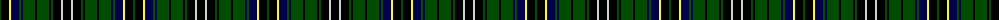

The parent of this is [MacAlpine D](/tartans/g/2/k8/y2/db8/g2/db2/g12/k2/g12/k2/g2/k8/n2/k/8/)

This was sourced from weddslist.  It is a [14 stripes tartan](/stripes/stripes14/).

Original link http://www.weddslist.com/cgi-bin/tartans/pg.pl?source=rb

## Thread count
G/2 K8 Y2 DB8 G2 DB2 G12 K2 G12 K2 G2 K8 N2 K/8

## Palette
Each colour and its ΔE from the base-6 reference it is a variant of.

| Colour | Shade | Base | ΔE (OKLab) |
|---|---|---|---|
| DB |  `#00004C` | B  | 0.21 |
| G |  `#004C00` | G  | 0.08 |
| K |  `#000000` | K  | 0.00 |
| N |  `#D0D0D0` | W  | 0.11 |
| Y |  `#FFFF00` | Y  | 0.16 |

ID: /variants/g/2/k8/y2/db8/g2/db2/g12/k2/g12/k2/g2/k8/n2/k/8-db00004c-g004c00-k000000-nd0d0d0-yffff00/
