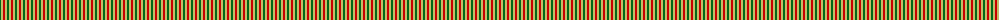
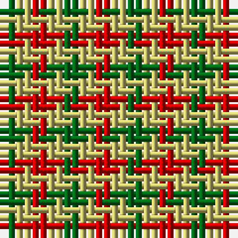

The parent of this is [Lochwood (Estate Check)](/tartans/g/2/lg2/r2/lg2/ga2/lg2/r/2/)

This was sourced from tartans-authority.  It is a [7 stripes tartan](/stripes/stripes7/).

Original link http://www.tartansauthority.com/tartan-ferret/display/5471/

## Thread count
G/2 LG2 R2 LG2 Ga2 LG2 R/2

## Palette
Each colour and its ΔE from the base-6 reference it is a variant of.

| Colour | Shade | Base | ΔE (OKLab) |
|---|---|---|---|
| G |  `#006818` | G  | 0.02 |
| Ga |  `#006818` | G  | 0.02 |
| LG |  `#C4BC68` | Y  | 0.07 |
| R |  `#C80000` | R  | 0.00 |

# Sample pattern

ID: /variants/g/2/lg2/r2/lg2/ga2/lg2/r/2-g006818-ga006818-lgc4bc68-rc80000/
