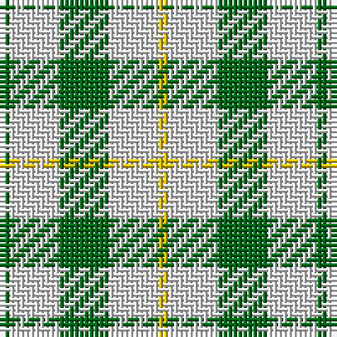

The parent of this is [Eastern Townshippers (Corporate)](/tartans/g/2/lna10/ga10/ln10/y/2/)

This was sourced from tartans-authority.  It is a [5 stripes tartan](/stripes/stripes5/).

Original link http://www.tartansauthority.com/tartan-ferret/display/7943/

## Thread count
G/2 LNa10 Ga10 LN10 Y/2

## Palette
Each colour and its ΔE from the base-6 reference it is a variant of.

| Colour | Shade | Base | ΔE (OKLab) |
|---|---|---|---|
| G |  `#006818` | G  | 0.02 |
| Ga |  `#006818` | G  | 0.02 |
| LN |  `#E0E0E0` | W  | 0.06 |
| LNa |  `#E0E0E0` | W  | 0.06 |
| Y |  `#E8C000` | Y  | 0.00 |

# Sample pattern

ID: /variants/g/2/lna10/ga10/ln10/y/2-g006818-ga006818-lne0e0e0-lnae0e0e0-ye8c000/
