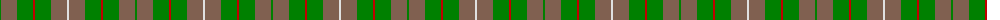
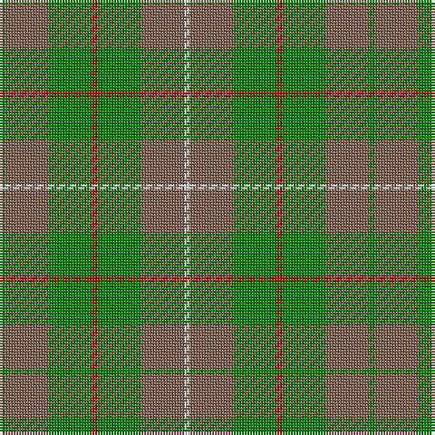

The parent of this is [MacKinnon, hunting](/tartans/g/2/lt16/g16/r2/g16/lt16/ln/2/)

This was sourced from weddslist.  It is a [7 stripes tartan](/stripes/stripes7/).

Original link http://www.weddslist.com/cgi-bin/tartans/pg.pl?source=sts

## Thread count
G/2 LT16 G16 R2 G16 LT16 LN/2

## Palette
Each colour and its ΔE from the base-6 reference it is a variant of.

| Colour | Shade | Base | ΔE (OKLab) |
|---|---|---|---|
| G |  `#008000` | G  | 0.09 |
| LN |  `#E0E0E0` | W  | 0.06 |
| LT |  `#806050` | R  | 0.17 |
| R |  `#C00000` | R  | 0.02 |

# Sample pattern

ID: /variants/g/2/lt16/g16/r2/g16/lt16/ln/2-g008000-lne0e0e0-lt806050-rc00000/
