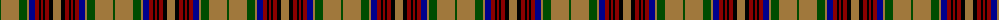

The parent of this is [California Firefighters (Corporate)](/tartans/g/2/lt18/g8/lt2/db6/dr4/k2/dr2/k2/dr4/k4/lt/8/)

This was sourced from tartans-authority.  It is a [12 stripes tartan](/stripes/stripes12/).

Original link http://www.tartansauthority.com/tartan-ferret/display/3787/

## Thread count
G/2 LT18 G8 LT2 DB6 DR4 K2 DR2 K2 DR4 K4 LT/8

## Palette
Each colour and its ΔE from the base-6 reference it is a variant of.

| Colour | Shade | Base | ΔE (OKLab) |
|---|---|---|---|
| DB |  `#00008C` | B  | 0.13 |
| DR |  `#8C0000` | R  | 0.13 |
| G |  `#004C00` | G  | 0.08 |
| K |  `#000000` | K  | 0.00 |
| LT |  `#A0783C` | R  | 0.18 |

ID: /variants/g/2/lt18/g8/lt2/db6/dr4/k2/dr2/k2/dr4/k4/lt/8-db00008c-dr8c0000-g004c00-k000000-lta0783c/
