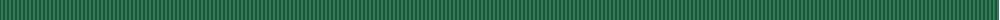
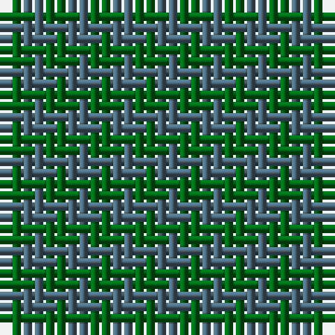

The parent of this is [Hafren (Personal)](/tartans/g/2/n/2/)

This was sourced from register-of-tartans.  It is a [2 stripes tartan](/stripes/stripes2/).

Original link https://www.tartanregister.gov.uk/tartanDetails.aspx?ref=1567

## Thread count
G/2 N/2

## Palette
G N

# Sample pattern

ID: /variants/g/2/n/2-g006818-n4c6878/
