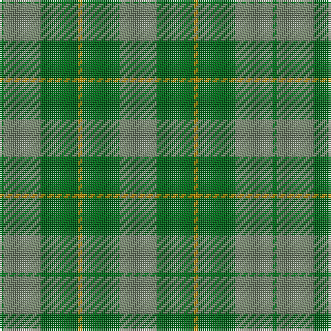

The parent of this is [Spring Morning](/tartans/g/2/n18/g18/dy2/g18/n/18/)

This was sourced from register-of-tartans.  It is a [6 stripes tartan](/stripes/stripes6/).

Original link https://www.tartanregister.gov.uk/tartanDetails.aspx?ref=3869

## Thread count
G/2 N18 G18 DY2 G18 N/18

## Palette
Each colour and its ΔE from the base-6 reference it is a variant of.

| Colour | Shade | Base | ΔE (OKLab) |
|---|---|---|---|
| DY |  `#D09800` | Y  | 0.11 |
| G |  `#006818` | G  | 0.02 |
| N |  `#74846C` | G  | 0.19 |

# Sample pattern

ID: /variants/g/2/n18/g18/dy2/g18/n/18-dyd09800-g006818-n74846c/
