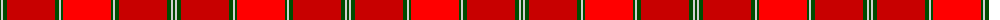
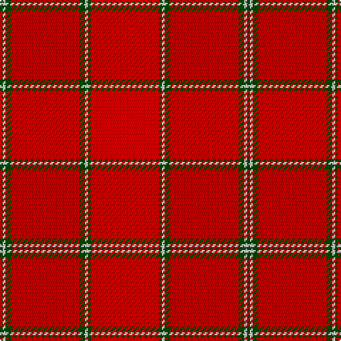

The parent of this is [MacNab WI1](/tartans/g/2/n2/g4/r48/g4/n2/g2/ra/48/)

This was sourced from weddslist.  It is a [8 stripes tartan](/stripes/stripes8/).

Original link http://www.weddslist.com/cgi-bin/tartans/pg.pl?source=rb

## Thread count
G/2 N2 G4 R48 G4 N2 G2 Ra/48

## Palette
Each colour and its ΔE from the base-6 reference it is a variant of.

| Colour | Shade | Base | ΔE (OKLab) |
|---|---|---|---|
| G |  `#004C00` | G  | 0.08 |
| N |  `#D0D0D0` | W  | 0.11 |
| R |  `#C80000` | R  | 0.00 |
| Ra |  `#FF0000` | R  | 0.11 |

# Sample pattern

ID: /variants/g/2/n2/g4/r48/g4/n2/g2/ra/48-g004c00-nd0d0d0-rc80000-raff0000/
