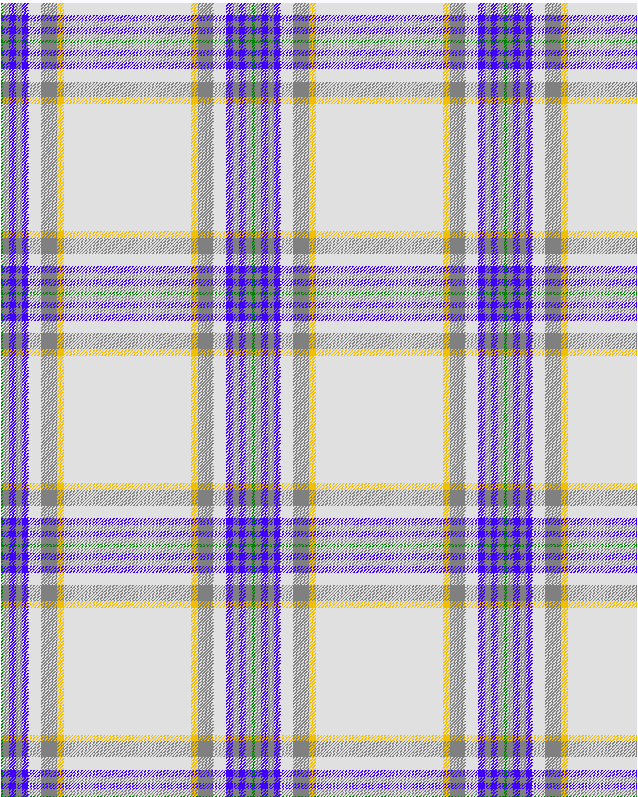

Boucherville (Tartan de..), dress

This was sourced from <no value>.  It is a 9 stripes tartan.

Original link http://www.weddslist.com/cgi-bin/tartans/pg.pl?source=sts

## Thread count
G/2 N8 B8 N8 B8 LN16 N20 Y8 LN/80

## Palette
B#4000FF G#008000 LN#E0E0E0 N#808080 Y#F0C000

# Sample pattern

ID: /variants/g/2/n8/b8/n8/b8/ln16/n20/y8/ln/80-b4000ff-g008000-lne0e0e0-n808080-yf0c000