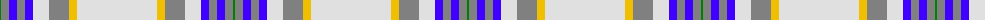

The parent of this is [Boucherville (Tartan de..), dress](/tartans/g/2/n8/b8/n8/b8/ln16/n20/y8/ln/80/)

This was sourced from weddslist.  It is a [9 stripes tartan](/stripes/stripes9/).

Original link http://www.weddslist.com/cgi-bin/tartans/pg.pl?source=sts

## Thread count
G/2 N8 B8 N8 B8 LN16 N20 Y8 LN/80

## Palette
Each colour and its ΔE from the base-6 reference it is a variant of.

| Colour | Shade | Base | ΔE (OKLab) |
|---|---|---|---|
| B |  `#4000FF` | B  | 0.20 |
| G |  `#008000` | G  | 0.09 |
| LN |  `#E0E0E0` | W  | 0.06 |
| N |  `#808080` | G  | 0.22 |
| Y |  `#F0C000` | Y  | 0.01 |

ID: /variants/g/2/n8/b8/n8/b8/ln16/n20/y8/ln/80-b4000ff-g008000-lne0e0e0-n808080-yf0c000/
