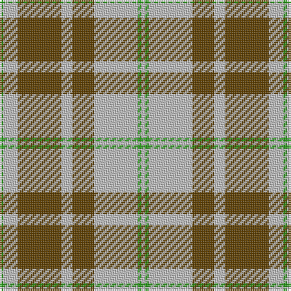

The parent of this is [O'Neill Pipe Band 1970 (Corporate)](/tartans/g/2/n8/t24/n6/t12/n24/g2/n/2/)

This was sourced from tartans-authority.  It is a [8 stripes tartan](/stripes/stripes8/).

Original link http://www.tartansauthority.com/tartan-ferret/display/5538/

## Thread count
G/2 N8 T24 N6 T12 N24 G2 N/2

## Palette
Each colour and its ΔE from the base-6 reference it is a variant of.

| Colour | Shade | Base | ΔE (OKLab) |
|---|---|---|---|
| G |  `#289C18` | G  | 0.18 |
| N |  `#C0C0C0` | W  | 0.16 |
| T |  `#604000` | G  | 0.14 |

# Sample pattern

ID: /variants/g/2/n8/t24/n6/t12/n24/g2/n/2-g289c18-nc0c0c0-t604000/
