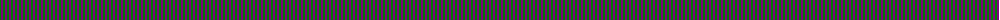
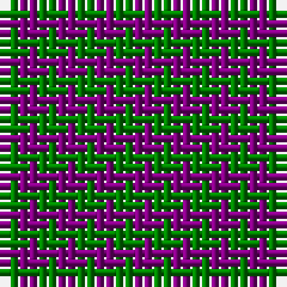

The parent of this is [Wilson's, No 116](/tartans/g/2/p/2/)

This was sourced from weddslist.  It is a [2 stripes tartan](/stripes/stripes2/).

Original link http://www.weddslist.com/cgi-bin/tartans/pg.pl?source=sts

## Thread count
G/2 P/2

## Palette
G P

# Sample pattern

ID: /variants/g/2/p/2-g008000-p800080/
