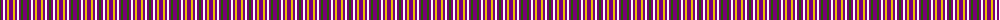

The parent of this is [Justus International (Personal)](/tartans/g/2/p2/w2/p2/y2/p4/y2/p2/w2/p2/g2/p/4/)

This was sourced from register-of-tartans.  It is a [12 stripes tartan](/stripes/stripes12/).

Original link https://www.tartanregister.gov.uk/tartanDetails.aspx?ref=1922

## Thread count
G/2 P2 W2 P2 Y2 P4 Y2 P2 W2 P2 G2 P/4

## Palette
Each colour and its ΔE from the base-6 reference it is a variant of.

| Colour | Shade | Base | ΔE (OKLab) |
|---|---|---|---|
| G |  `#285800` | G  | 0.04 |
| LN |  `#E0E0E0` | W  | 0.06 |
| P |  `#780078` | B  | 0.16 |
| W |  `#FCFCFC` | W  | 0.03 |
| Y |  `#E8C000` | Y  | 0.00 |

ID: /variants/g/2/p2/w2/p2/y2/p4/y2/p2/w2/p2/g2/p/4-g285800-lne0e0e0-p780078-wfcfcfc-ye8c000/
