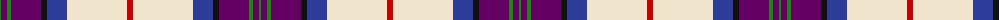
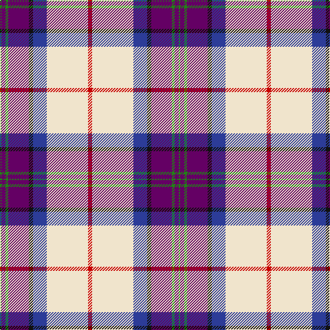

The parent of this is [S.O.B.H.D. (Corporate)](/tartans/g/2/p6/g4/p30/k6/b20/w60/r/6/)

This was sourced from tartans-authority.  It is a [8 stripes tartan](/stripes/stripes8/).

Original link http://www.tartansauthority.com/tartan-ferret/display/7833/

## Thread count
G/2 P6 G4 P30 K6 B20 W60 R/6

## Palette
Each colour and its ΔE from the base-6 reference it is a variant of.

| Colour | Shade | Base | ΔE (OKLab) |
|---|---|---|---|
| B |  `#2C3C98` | B  | 0.04 |
| G |  `#208414` | G  | 0.10 |
| K |  `#101010` | K  | 0.17 |
| P |  `#640064` | B  | 0.15 |
| R |  `#C80000` | R  | 0.00 |
| W |  `#F0E4CC` | W  | 0.05 |

# Sample pattern

ID: /variants/g/2/p6/g4/p30/k6/b20/w60/r/6-b2c3c98-g208414-k101010-p640064-rc80000-wf0e4cc/
