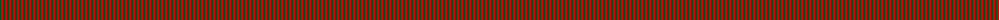
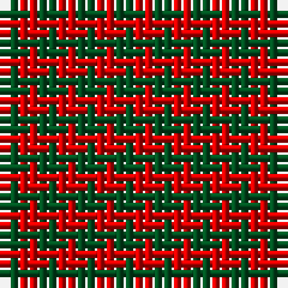

The parent of this is [Glenlyon (District)](/tartans/g/2/r/2/)

This was sourced from register-of-tartans.  It is a [2 stripes tartan](/stripes/stripes2/).

Original link https://www.tartanregister.gov.uk/tartanDetails.aspx?ref=1424

## Thread count
G/2 R/2

## Palette
Each colour and its ΔE from the base-6 reference it is a variant of.

| Colour | Shade | Base | ΔE (OKLab) |
|---|---|---|---|
| G |  `#005020` | G  | 0.08 |
| R |  `#DC0000` | R  | 0.04 |

# Sample pattern

ID: /variants/g/2/r/2-g005020-rdc0000/
