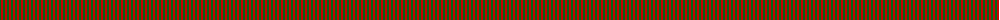
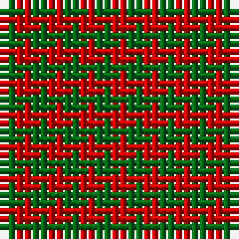

The parent of this is [Moncreiffe](/tartans/g/2/r/2/)

This was sourced from register-of-tartans.  It is a [2 stripes tartan](/stripes/stripes2/).

Original link https://www.tartanregister.gov.uk/tartanDetails.aspx?ref=2980

## Thread count
G/2 R/2

## Palette
G R

# Sample pattern

ID: /variants/g/2/r/2-g006818-rc80000/
