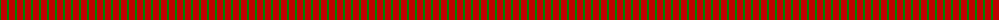
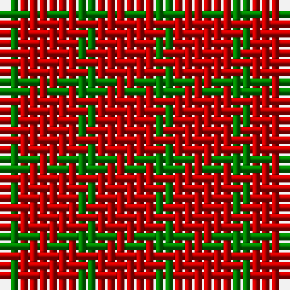

The parent of this is [Wilson's, No 134](/tartans/g/2/r/6/)

This was sourced from weddslist.  It is a [2 stripes tartan](/stripes/stripes2/).

Original link http://www.weddslist.com/cgi-bin/tartans/pg.pl?source=sts

## Thread count
G/2 R/6

## Palette
G R

# Sample pattern

ID: /variants/g/2/r/6-g008000-rc00000/
