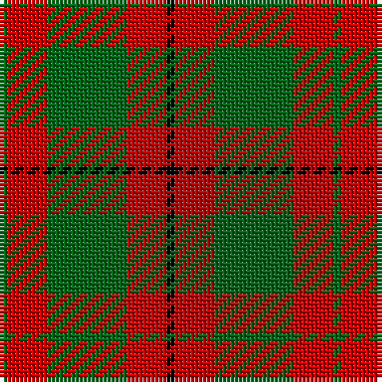

The parent of this is [Murray, Lord George (Hose)](/tartans/g/2/r10/g20/r10/k/2/)

This was sourced from tartans-authority.  It is a [5 stripes tartan](/stripes/stripes5/).

Original link http://www.tartansauthority.com/tartan-ferret/display/5644/

## Thread count
G/2 R10 G20 R10 K/2

## Palette
Each colour and its ΔE from the base-6 reference it is a variant of.

| Colour | Shade | Base | ΔE (OKLab) |
|---|---|---|---|
| G |  `#006818` | G  | 0.02 |
| K |  `#000000` | K  | 0.00 |
| R |  `#C80000` | R  | 0.00 |

# Sample pattern

ID: /variants/g/2/r10/g20/r10/k/2-g006818-k000000-rc80000/
